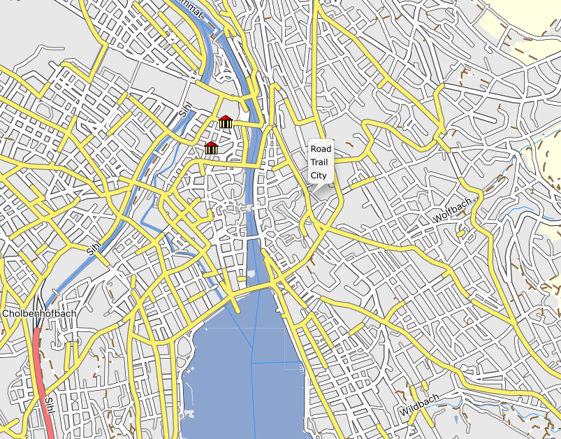

# SwissTopo Garmin

This repository contains a script to download SwissTopo maps and convert them to a format that can be used on a Garmin GPS device.

The official SwissTopo maps are available for free on the [SwissTopo website](https://www.swisstopo.admin.ch/).

## Approach

The vector maps are available in two formats: File-Geodatabase (GDB) and GeoPackage (GPKG). The GPKG format is more convenient to work with, so we will use that format.

We need to convert the GPKG file to an OSM file. We will use the `ogr2osm` tool for this.

    ogr2osm --no-memory-copy SWISSTLM3D_2024_LV95_LN02.gpkg -o SWISSTLM3D_2024_LV95_LN02.osm

Once in OSM format, we can use the `mkgmap` tool to convert the OSM file to a Garmin map.

This repository contains the mkgmap style file that contains the mapping of OSM tags (which in our case are SwissTopo tags) to Garmin tags.

## State of the project

The project is in a very early stage. The script is not yet complete and the resulting map is missing some important features.

Currently, the resulting map looks like this (in Garmin BaseCamp):

